# System Architecture

## Overview

The User Service follows a **layered architecture** pattern with clear separation of concerns, designed for scalability, maintainability, and testability. The service is built as a cloud-native microservice with stateless application instances backed by persistent storage.

## Architectural Principles

1. **Separation of Concerns** - Clear boundaries between layers (API, business logic, data access)
2. **Stateless Application** - All state stored in PostgreSQL and Redis for horizontal scalability
3. **API-First Design** - OpenAPI specification drives implementation and documentation
4. **Security by Default** - Authentication and authorization enforced at multiple layers
5. **Fail-Fast Validation** - Input validation at API boundary before processing
6. **Idempotency** - Critical operations designed to be safely retried
7. **Observable System** - Comprehensive logging, metrics, and tracing

## Layered Architecture

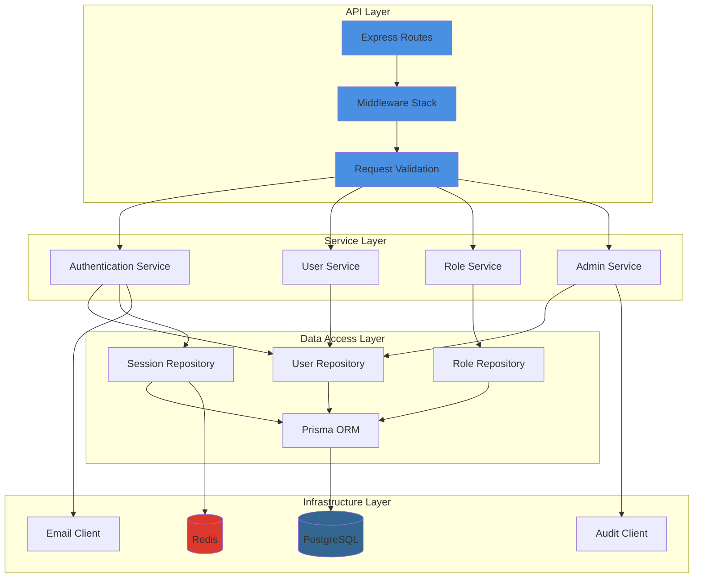

## Component Architecture

### 1. API Layer

The API layer handles HTTP requests, routing, and response formatting.

**Components:**
- **Express Routes** - RESTful endpoint definitions
- **Middleware Stack** - Request processing pipeline
- **Request Validation** - Schema-based validation using Joi/Zod
- **Error Handler** - Centralized error handling and formatting
- **Response Formatter** - Consistent API response structure

**Middleware Pipeline:**

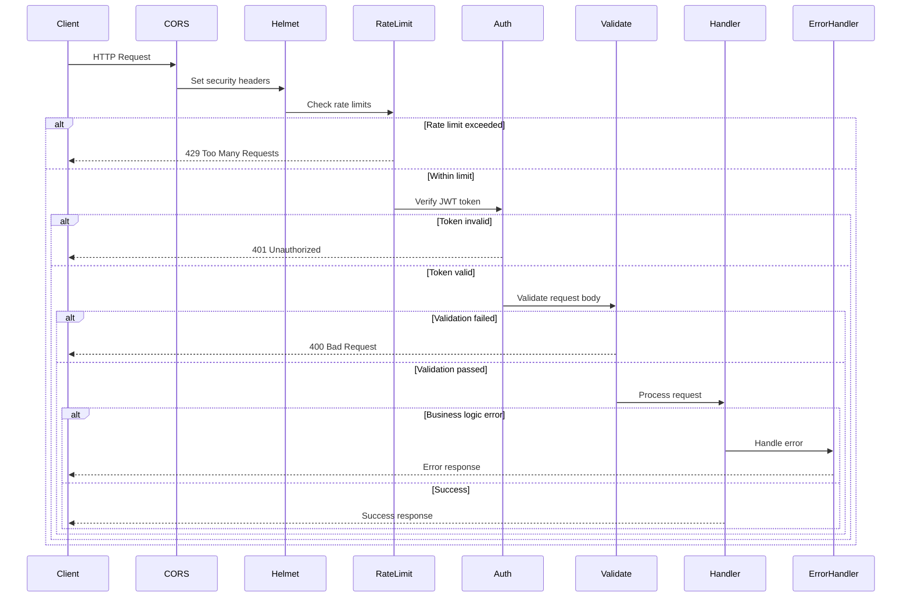

### 2. Service Layer

The service layer contains business logic and orchestrates data access operations.

**Services:**

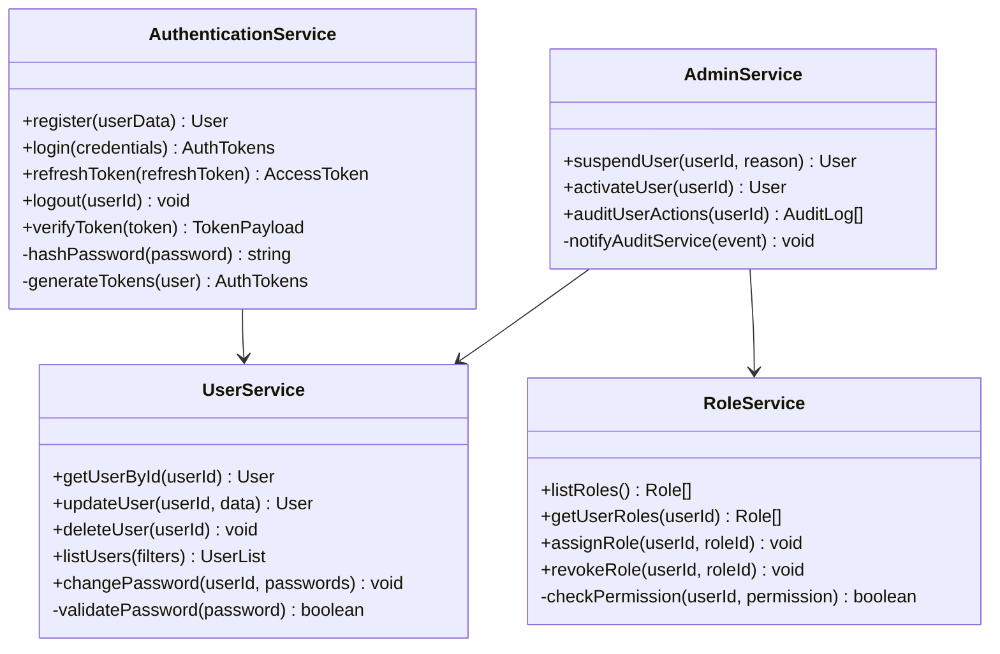

### 3. Data Access Layer

The data access layer abstracts database operations using the Repository pattern.

**Repository Structure:**

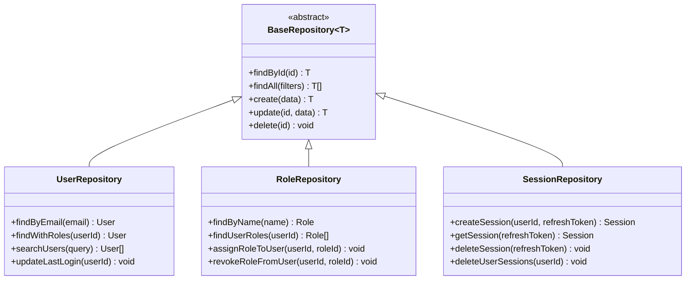

## Data Flow Architecture

### Registration Flow

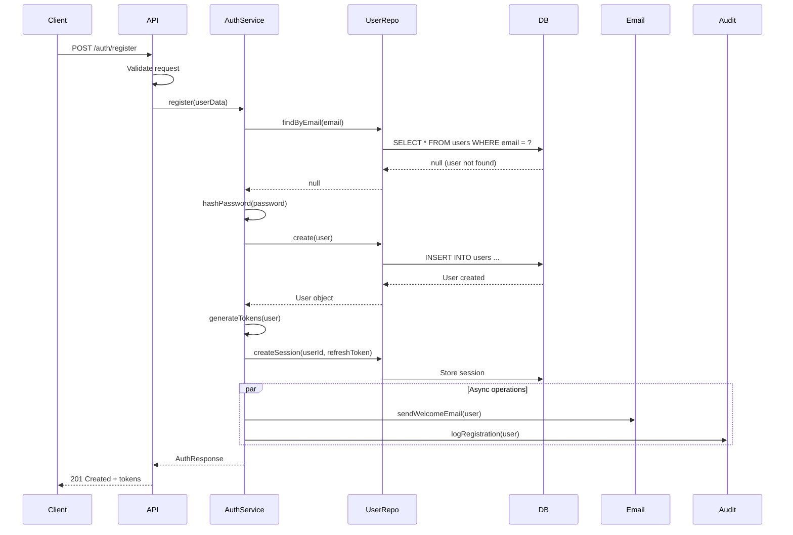

### Authentication Flow

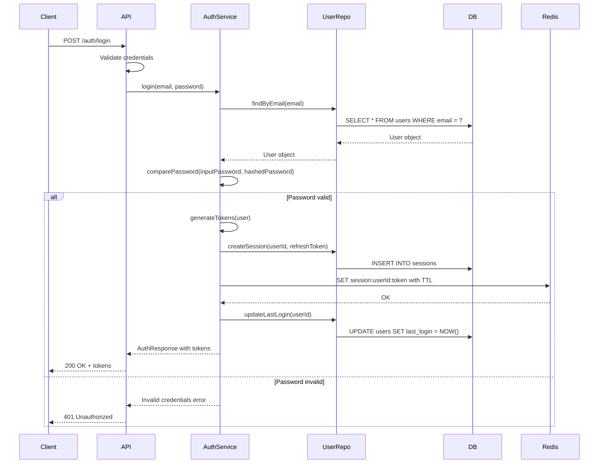

### Authorization Flow

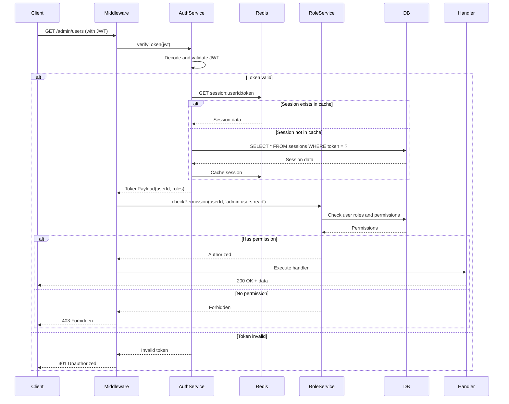

## Database Schema

### Entity Relationship Diagram

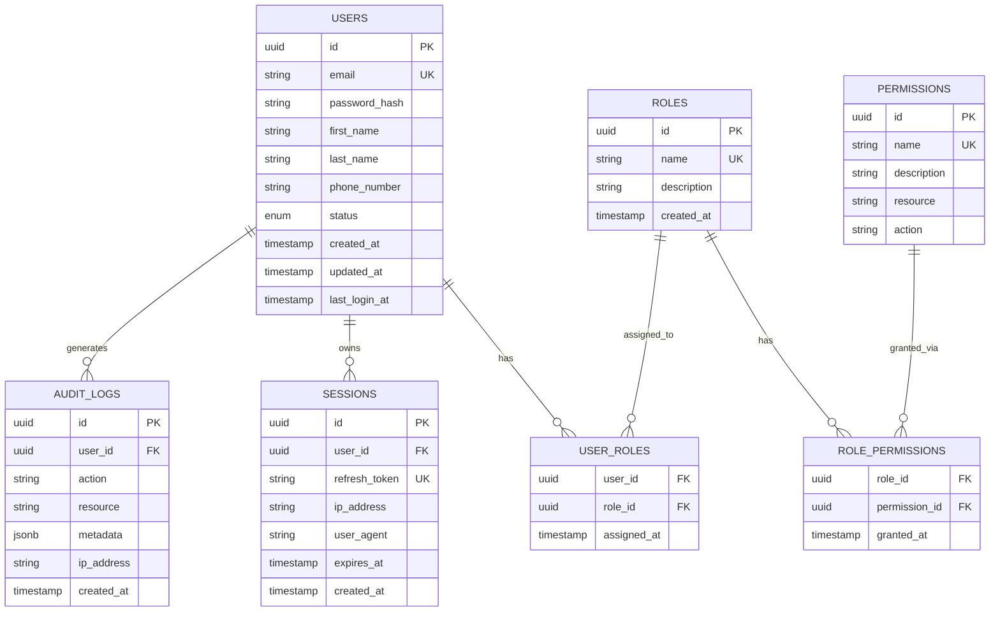

### Indexing Strategy

| Table | Index | Columns | Type | Purpose |
|-------|-------|---------|------|---------|
| users | idx_users_email | email | UNIQUE | Fast email lookup for authentication |
| users | idx_users_status | status | BTREE | Filter users by status |
| users | idx_users_created_at | created_at | BTREE | Time-based queries |
| sessions | idx_sessions_user_id | user_id | BTREE | Find all user sessions |
| sessions | idx_sessions_expires_at | expires_at | BTREE | Cleanup expired sessions |
| sessions | idx_sessions_refresh_token | refresh_token | UNIQUE | Fast token lookup |
| user_roles | idx_user_roles_user_id | user_id | BTREE | Get user's roles |
| user_roles | idx_user_roles_role_id | role_id | BTREE | Get role's users |
| audit_logs | idx_audit_user_id | user_id | BTREE | User activity history |
| audit_logs | idx_audit_created_at | created_at | BTREE | Time-based audit queries |

## Caching Strategy

### Redis Cache Architecture

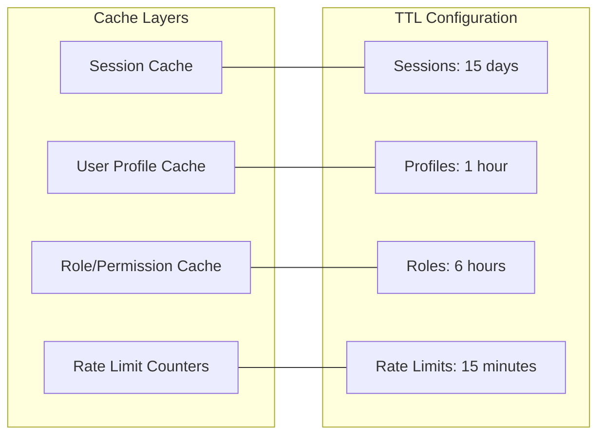

**Cache Keys:**
- `session:{userId}:{tokenId}` - User session with refresh token
- `user:profile:{userId}` - User profile data
- `user:roles:{userId}` - User's roles and permissions
- `ratelimit:{identifier}:{endpoint}` - Rate limit counters

**Cache Invalidation:**
- **Session cache**: Invalidated on logout or password change
- **User profile**: Invalidated on profile update
- **Roles cache**: Invalidated on role assignment/revocation
- **Rate limit**: Expires automatically based on TTL

## Scalability Considerations

### Horizontal Scaling

The User Service is designed to scale horizontally:

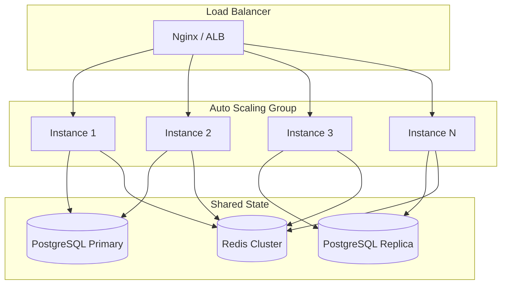

**Scaling Triggers:**
- CPU utilization > 70%
- Memory utilization > 80%
- Request rate > 1000 req/s per instance
- Response time p95 > 300ms

### Performance Optimizations

1. **Connection Pooling** - PostgreSQL connection pool (min: 10, max: 30)
2. **Redis Pipelining** - Batch multiple Redis operations
3. **Database Read Replicas** - Read-heavy operations use replicas
4. **Prepared Statements** - Prisma uses prepared statements
5. **Response Compression** - Gzip compression for responses > 1KB
6. **Query Optimization** - Indexed queries and efficient JOINs

## Security Architecture

### Defense in Depth

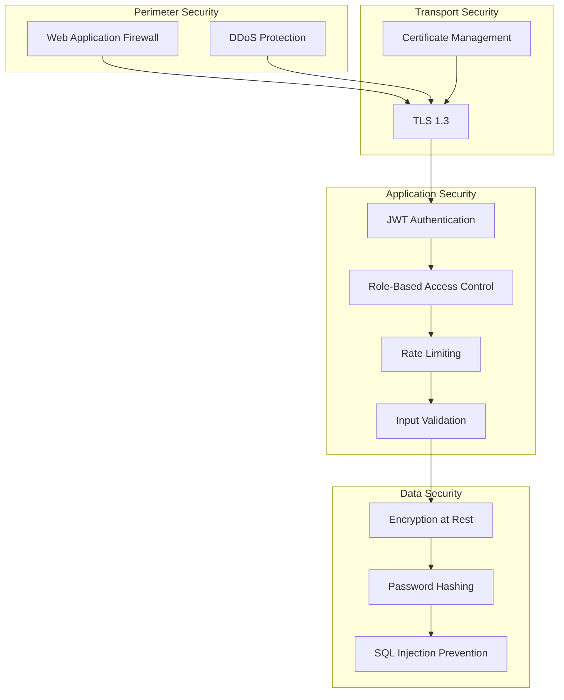

### Security Layers

1. **Network Layer** - VPC isolation, security groups, firewall rules
2. **Transport Layer** - TLS 1.3, strong cipher suites
3. **Application Layer** - JWT authentication, RBAC, rate limiting
4. **Data Layer** - Encryption at rest, password hashing (bcrypt)
5. **Audit Layer** - Comprehensive audit logging

## Failure Scenarios & Recovery

### Circuit Breaker Pattern

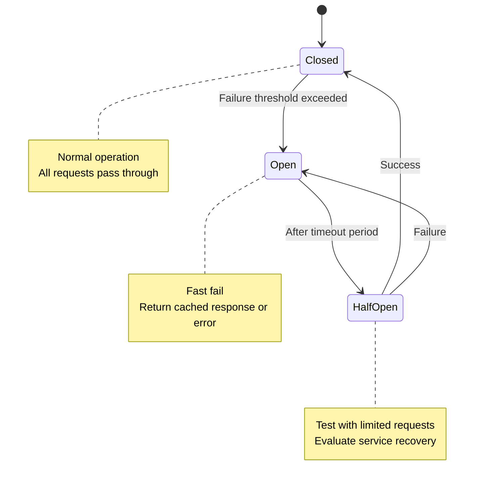

### Graceful Degradation

| Dependency | Failure Mode | Degradation Strategy |
|------------|--------------|----------------------|
| PostgreSQL Primary | Connection timeout | Use read replica for read operations |
| Redis Cache | Connection failure | Bypass cache, direct database queries |
| Email Service | API timeout | Queue emails for retry, continue request |
| Audit Service | Unavailable | Log locally, sync when available |

---

**Relevant Source Files:**
- [services/user-service/src/middleware/](https://github.com/brunokino/backstage-entities-example)
- [services/user-service/src/services/](https://github.com/brunokino/backstage-entities-example)
- [services/user-service/src/repositories/](https://github.com/brunokino/backstage-entities-example)
- [services/user-service/prisma/schema.prisma](https://github.com/brunokino/backstage-entities-example)

**Last Updated**: 2025-01-07  
**Document Owner**: Platform Team

