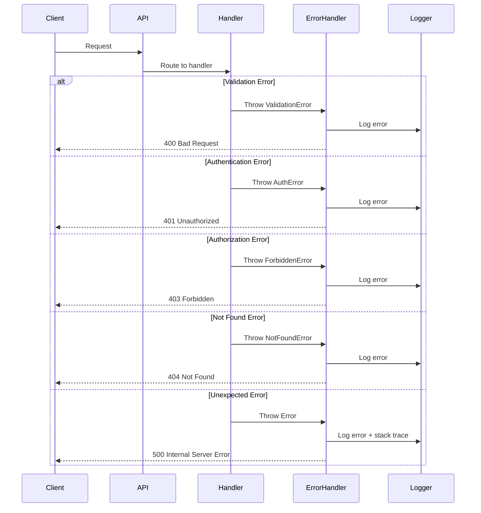

# Error Handling

## Overview

The User Service implements comprehensive error handling with standardized error responses, proper HTTP status codes, and detailed error messages for debugging and troubleshooting.

## Error Response Format

All error responses follow a consistent structure:

```json
{
  "error": "ErrorType",
  "message": "Human-readable error message",
  "statusCode": 400,
  "details": [
    {
      "field": "email",
      "message": "Must be a valid email address"
    }
  ],
  "timestamp": "2025-01-07T10:30:00Z",
  "path": "/api/v1/users",
  "requestId": "req_abc123def456"
}
```

**Field Descriptions:**

| Field | Type | Description |
|-------|------|-------------|
| `error` | string | Error type/class (e.g., ValidationError, AuthenticationError) |
| `message` | string | Human-readable error message |
| `statusCode` | number | HTTP status code |
| `details` | array | Optional detailed error information (e.g., validation errors) |
| `timestamp` | string | ISO 8601 timestamp when error occurred |
| `path` | string | API endpoint where error occurred |
| `requestId` | string | Unique request identifier for tracing |

## HTTP Status Codes

### 2xx Success

| Code | Name | Usage |
|------|------|-------|
| 200 | OK | Successful GET, PATCH requests |
| 201 | Created | Successful POST requests (resource created) |
| 204 | No Content | Successful DELETE or PUT with no response body |

### 4xx Client Errors

| Code | Name | Usage | Example |
|------|------|-------|---------|
| 400 | Bad Request | Invalid request format or validation failure | Malformed JSON, missing required fields |
| 401 | Unauthorized | Missing or invalid authentication | No token, expired token, invalid token |
| 403 | Forbidden | Insufficient permissions | User lacks required role/permission |
| 404 | Not Found | Resource does not exist | User ID doesn't exist in database |
| 409 | Conflict | Resource already exists | Email already registered |
| 422 | Unprocessable Entity | Semantic errors in request | Invalid state transition |
| 429 | Too Many Requests | Rate limit exceeded | Too many login attempts |

### 5xx Server Errors

| Code | Name | Usage | Example |
|------|------|-------|---------|
| 500 | Internal Server Error | Unexpected server error | Unhandled exception, database connection failure |
| 503 | Service Unavailable | Service temporarily down | Maintenance mode, dependency unavailable |

## Error Types

### Validation Errors (400)

Returned when request data fails validation.

**Example:**

```json
{
  "error": "ValidationError",
  "message": "Request validation failed",
  "statusCode": 400,
  "details": [
    {
      "field": "email",
      "message": "Must be a valid email address"
    },
    {
      "field": "password",
      "message": "Must be at least 8 characters long"
    }
  ],
  "timestamp": "2025-01-07T10:30:00Z",
  "path": "/api/v1/auth/register"
}
```

### Authentication Errors (401)

Returned when authentication fails or is missing.

**Examples:**

**No Token:**

```json
{
  "error": "AuthenticationError",
  "message": "No authentication token provided",
  "statusCode": 401,
  "timestamp": "2025-01-07T10:30:00Z",
  "path": "/api/v1/users"
}
```

**Expired Token:**

```json
{
  "error": "TokenExpiredError",
  "message": "Access token has expired",
  "statusCode": 401,
  "timestamp": "2025-01-07T10:30:00Z",
  "path": "/api/v1/users/me"
}
```

**Invalid Credentials:**

```json
{
  "error": "InvalidCredentialsError",
  "message": "Invalid email or password",
  "statusCode": 401,
  "timestamp": "2025-01-07T10:30:00Z",
  "path": "/api/v1/auth/login"
}
```

### Authorization Errors (403)

Returned when user lacks required permissions.

**Example:**

```json
{
  "error": "ForbiddenError",
  "message": "Insufficient permissions. Required: users:delete",
  "statusCode": 403,
  "details": {
    "requiredPermission": "users:delete",
    "userPermissions": ["users:read", "users:write"]
  },
  "timestamp": "2025-01-07T10:30:00Z",
  "path": "/api/v1/users/550e8400-e29b-41d4-a716-446655440000"
}
```

### Not Found Errors (404)

Returned when requested resource doesn't exist.

**Example:**

```json
{
  "error": "NotFoundError",
  "message": "User not found",
  "statusCode": 404,
  "details": {
    "userId": "550e8400-e29b-41d4-a716-446655440000"
  },
  "timestamp": "2025-01-07T10:30:00Z",
  "path": "/api/v1/users/550e8400-e29b-41d4-a716-446655440000"
}
```

### Conflict Errors (409)

Returned when resource already exists.

**Example:**

```json
{
  "error": "ConflictError",
  "message": "User with this email already exists",
  "statusCode": 409,
  "details": {
    "email": "john.doe@example.com"
  },
  "timestamp": "2025-01-07T10:30:00Z",
  "path": "/api/v1/auth/register"
}
```

### Rate Limit Errors (429)

Returned when rate limit is exceeded.

**Example:**

```json
{
  "error": "RateLimitExceeded",
  "message": "Too many requests. Please try again later.",
  "statusCode": 429,
  "details": {
    "limit": 100,
    "window": "15 minutes",
    "retryAfter": 900
  },
  "timestamp": "2025-01-07T10:30:00Z",
  "path": "/api/v1/auth/login"
}
```

### Internal Server Errors (500)

Returned for unexpected server errors.

**Example:**

```json
{
  "error": "InternalServerError",
  "message": "An unexpected error occurred",
  "statusCode": 500,
  "timestamp": "2025-01-07T10:30:00Z",
  "path": "/api/v1/users",
  "requestId": "req_abc123def456"
}
```

**Note:** Internal errors don't expose sensitive details in production.

## Error Handling Flow



## Common Error Scenarios

### Scenario 1: Invalid Email Format

**Request:**

```bash
curl -X POST https://user-service.kinoshita-labs.com/api/v1/auth/register \
  -H "Content-Type: application/json" \
  -d '{"email":"invalid-email","password":"SecurePass123!"}'
```

**Response (400):**

```json
{
  "error": "ValidationError",
  "message": "Request validation failed",
  "statusCode": 400,
  "details": [
    {
      "field": "email",
      "message": "Must be a valid email address"
    },
    {
      "field": "firstName",
      "message": "First name is required"
    },
    {
      "field": "lastName",
      "message": "Last name is required"
    }
  ],
  "timestamp": "2025-01-07T10:30:00Z",
  "path": "/api/v1/auth/register"
}
```

### Scenario 2: Expired Access Token

**Request:**

```bash
curl -X GET https://user-service.kinoshita-labs.com/api/v1/users/me \
  -H "Authorization: Bearer <expired-token>"
```

**Response (401):**

```json
{
  "error": "TokenExpiredError",
  "message": "Access token has expired. Please refresh your token.",
  "statusCode": 401,
  "timestamp": "2025-01-07T10:30:00Z",
  "path": "/api/v1/users/me"
}
```

**Solution:** Refresh the token using `/auth/refresh` endpoint.

### Scenario 3: Insufficient Permissions

**Request:**

```bash
curl -X DELETE https://user-service.kinoshita-labs.com/api/v1/users/abc123 \
  -H "Authorization: Bearer <user-token>"
```

**Response (403):**

```json
{
  "error": "ForbiddenError",
  "message": "Insufficient permissions. Required: users:delete",
  "statusCode": 403,
  "details": {
    "requiredPermission": "users:delete",
    "userPermissions": ["users:read"]
  },
  "timestamp": "2025-01-07T10:30:00Z",
  "path": "/api/v1/users/abc123"
}
```

**Solution:** Contact administrator to assign appropriate role.

### Scenario 4: User Not Found

**Request:**

```bash
curl -X GET https://user-service.kinoshita-labs.com/api/v1/users/nonexistent-id \
  -H "Authorization: Bearer <token>"
```

**Response (404):**

```json
{
  "error": "NotFoundError",
  "message": "User not found",
  "statusCode": 404,
  "details": {
    "userId": "nonexistent-id"
  },
  "timestamp": "2025-01-07T10:30:00Z",
  "path": "/api/v1/users/nonexistent-id"
}
```

### Scenario 5: Duplicate Email

**Request:**

```bash
curl -X POST https://user-service.kinoshita-labs.com/api/v1/auth/register \
  -H "Content-Type: application/json" \
  -d '{"email":"existing@example.com","password":"SecurePass123!","firstName":"John","lastName":"Doe"}'
```

**Response (409):**

```json
{
  "error": "ConflictError",
  "message": "User with this email already exists",
  "statusCode": 409,
  "details": {
    "email": "existing@example.com"
  },
  "timestamp": "2025-01-07T10:30:00Z",
  "path": "/api/v1/auth/register"
}
```

## Logging

### Error Logging Levels

| Level | Usage | Example |
|-------|-------|---------|
| **ERROR** | Application errors requiring attention | Database connection failure, unhandled exceptions |
| **WARN** | Potentially harmful situations | Rate limit warnings, deprecated API usage |
| **INFO** | Informational messages | User registration, login events |
| **DEBUG** | Detailed diagnostic information | Request/response details, query execution |

### Log Format

```json
{
  "level": "error",
  "message": "Database connection failed",
  "timestamp": "2025-01-07T10:30:00Z",
  "service": "user-service",
  "environment": "production",
  "requestId": "req_abc123def456",
  "userId": "550e8400-e29b-41d4-a716-446655440000",
  "path": "/api/v1/users",
  "method": "GET",
  "statusCode": 500,
  "error": {
    "name": "DatabaseError",
    "message": "Connection timeout",
    "stack": "..."
  }
}
```

## Debugging

### Using Request IDs

Every request receives a unique `requestId` which is included in:
- Response headers: `X-Request-ID`
- Error responses: `requestId` field
- Server logs: All log entries for the request

**Tracing a request:**

```bash
# Search logs by request ID
grep "req_abc123def456" /var/log/user-service/*.log

# Or use logging platform
https://logs.kinoshita-labs.com/search?query=requestId:req_abc123def456
```

### Common Debugging Steps

1. **Check error response** - Read error message and details
2. **Verify authentication** - Ensure token is valid and not expired
3. **Check permissions** - Confirm user has required roles/permissions
4. **Review request format** - Validate request body against API spec
5. **Check logs** - Use requestId to trace through server logs
6. **Verify dependencies** - Ensure database and Redis are accessible

## Client Error Handling

### JavaScript/TypeScript Example

```typescript
async function createUser(userData: UserData) {
  try {
    const response = await fetch('https://user-service.kinoshita-labs.com/api/v1/users', {
      method: 'POST',
      headers: {
        'Content-Type': 'application/json',
        'Authorization': `Bearer ${accessToken}`,
      },
      body: JSON.stringify(userData),
    });
    
    if (!response.ok) {
      const error = await response.json();
      
      switch (error.statusCode) {
        case 400:
          // Validation error - show field errors to user
          handleValidationErrors(error.details);
          break;
        case 401:
          // Token expired - refresh and retry
          await refreshToken();
          return createUser(userData); // Retry
        case 403:
          // Insufficient permissions
          showPermissionError(error.message);
          break;
        case 409:
          // Conflict - email already exists
          showConflictError(error.message);
          break;
        default:
          // Unexpected error
          showGenericError();
      }
      
      throw new Error(error.message);
    }
    
    return await response.json();
    
  } catch (error) {
    console.error('Failed to create user:', error);
    throw error;
  }
}
```

### Python Example

```python
import requests
from typing import Dict, Any

class UserServiceError(Exception):
    def __init__(self, error_data: Dict[str, Any]):
        self.error = error_data.get('error')
        self.message = error_data.get('message')
        self.status_code = error_data.get('statusCode')
        self.details = error_data.get('details')
        super().__init__(self.message)

def create_user(user_data: dict, access_token: str):
    try:
        response = requests.post(
            'https://user-service.kinoshita-labs.com/api/v1/users',
            json=user_data,
            headers={'Authorization': f'Bearer {access_token}'}
        )
        
        if not response.ok:
            error_data = response.json()
            
            if error_data['statusCode'] == 400:
                # Validation error
                handle_validation_errors(error_data['details'])
            elif error_data['statusCode'] == 401:
                # Token expired
                refresh_token()
                return create_user(user_data, get_new_token())
            elif error_data['statusCode'] == 403:
                # Permission denied
                raise PermissionError(error_data['message'])
            elif error_data['statusCode'] == 409:
                # Conflict
                raise ValueError(error_data['message'])
            
            raise UserServiceError(error_data)
        
        return response.json()
        
    except requests.RequestException as e:
        print(f'Request failed: {e}')
        raise
```

---

**Last Updated**: 2025-01-07  
**Document Owner**: Platform Team

