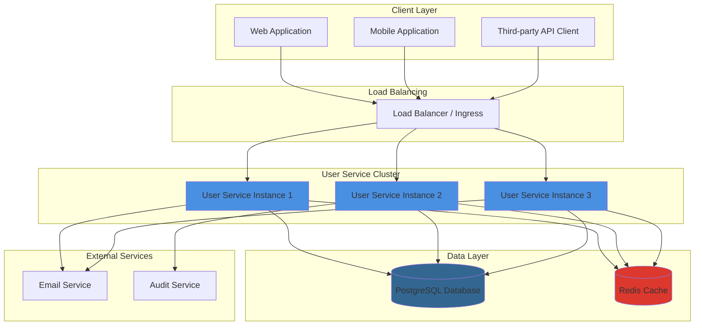
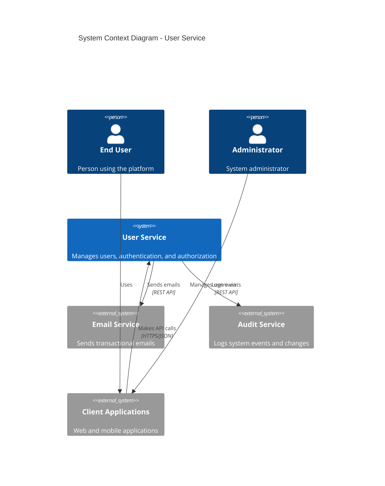

# User Service Overview

## Introduction

The User Service is a production-grade RESTful API microservice designed for comprehensive user management, authentication, and authorization. Built on modern cloud-native principles, it provides secure and scalable user lifecycle operations for the Kinoshita Labs identity platform.

## Purpose and Scope

The User Service serves as the central authentication and authorization hub, providing:

- **User Registration & Profile Management** - Complete user lifecycle from registration to deletion
- **Authentication** - JWT-based authentication with refresh token mechanism
- **Authorization** - Role-based access control (RBAC) with fine-grained permissions
- **User Search & Listing** - Advanced filtering and pagination capabilities
- **Account Lifecycle Management** - Suspension, activation, and soft deletion workflows
- **Administrative Operations** - Privileged operations for system administrators

## Technology Stack

| Component | Technology | Purpose |
|-----------|-----------|---------|
| Runtime | Node.js 20 LTS | JavaScript runtime environment |
| Framework | Express.js 4.x | Web application framework |
| Language | TypeScript 5.x | Type-safe development |
| Database | PostgreSQL 15 | Primary data store |
| Cache | Redis 7.x | Session management and rate limiting |
| Authentication | JWT (jsonwebtoken) | Token-based authentication |
| API Documentation | OpenAPI 3.0 / Swagger | API specification and documentation |
| Validation | Joi / Zod | Request validation |
| ORM | Prisma 5.x | Database access and migrations |
| Testing | Jest + Supertest | Unit and integration testing |
| Logging | Winston / Pino | Structured logging |
| Monitoring | Prometheus + Grafana | Metrics and visualization |

## High-Level Architecture

## Core Features

### 1. User Registration & Authentication

- Email/password-based registration with validation
- Secure password hashing using bcrypt (cost factor: 12)
- JWT-based authentication with access and refresh tokens
- Token refresh mechanism for seamless user experience
- Secure logout with token invalidation

### 2. Role-Based Access Control (RBAC)

- Flexible role assignment system
- Permission-based authorization
- Built-in roles: `user`, `moderator`, `admin`
- Custom role creation capability
- Multi-role support per user

### 3. User Profile Management

- Comprehensive profile fields (name, email, phone, etc.)
- Profile update with validation
- Secure password change workflow
- Account status management (active, inactive, suspended)

### 4. Administrative Capabilities

- User search and filtering
- Account suspension and reactivation
- Role management operations
- Audit trail for administrative actions

### 5. Security Features

- Rate limiting (100 req/15min anonymous, 1000 req/15min authenticated)
- Input validation and sanitization
- SQL injection prevention via Prisma ORM
- XSS protection
- CORS configuration
- Security headers (Helmet.js)
- Password complexity requirements

## API Capabilities

The User Service exposes a RESTful API with the following endpoint categories:

| Category | Base Path | Description |
|----------|-----------|-------------|
| Health | `/health` | Service health and status checks |
| Authentication | `/auth/*` | Login, registration, token management |
| Users | `/users/*` | User CRUD operations and profile management |
| Roles | `/roles/*` | Role management and assignment |
| Admin | `/admin/*` | Administrative operations |

For detailed API documentation, see [API Reference](api-reference.md).

## System Context

## Key Metrics & SLOs

| Metric | Target | Current |
|--------|--------|---------|
| Availability | 99.9% | 99.95% |
| Response Time (p95) | < 200ms | 145ms |
| Response Time (p99) | < 500ms | 380ms |
| Error Rate | < 0.1% | 0.04% |
| Throughput | > 1000 req/s | 1,250 req/s |

## Navigation Guide

- **[Architecture](architecture.md)** - Detailed system architecture, components, and design patterns
- **[Technology Stack](technology-stack.md)** - Comprehensive technology choices and rationale
- **[API Reference](api-reference.md)** - Complete API endpoint documentation
- **[Authentication](authentication.md)** - Authentication flows and security model
- **[Error Handling](error-handling.md)** - Error codes, formats, and troubleshooting
- **[Local Development](local-development.md)** - Setup guide for local development
- **[Testing](testing.md)** - Testing strategy and guidelines
- **[Deployment](deployment.md)** - Deployment architecture and procedures
- **[Monitoring](monitoring.md)** - Observability, metrics, and alerting
- **[Security](security.md)** - Security architecture and best practices

## Quick Start

To get started with the User Service:

1. **Prerequisites**: Ensure you have Node.js 20+, PostgreSQL 15+, and Redis 7+ installed
2. **Clone the repository**: Follow the [Local Development](local-development.md) guide
3. **Configure environment**: Set up `.env` with database and Redis connection strings
4. **Run migrations**: Execute `npm run migrate` to set up the database schema
5. **Start the service**: Run `npm run dev` for development mode
6. **Access API docs**: Navigate to `http://localhost:3000/api-docs` for Swagger UI

For detailed setup instructions, see [Local Development](local-development.md).

## Support & Contact

- **Team**: Platform Engineering Team
- **Email**: platform-team@kinoshita-labs.com
- **Slack**: #platform-team
- **On-call**: PagerDuty rotation (see Backstage)
- **Repository**: [github.com/brunokino/backstage-entities-example](https://github.com/brunokino/backstage-entities-example)

---

**Last Updated**: 2025-01-07  
**Document Owner**: Platform Team  
**Version**: 1.0.0

