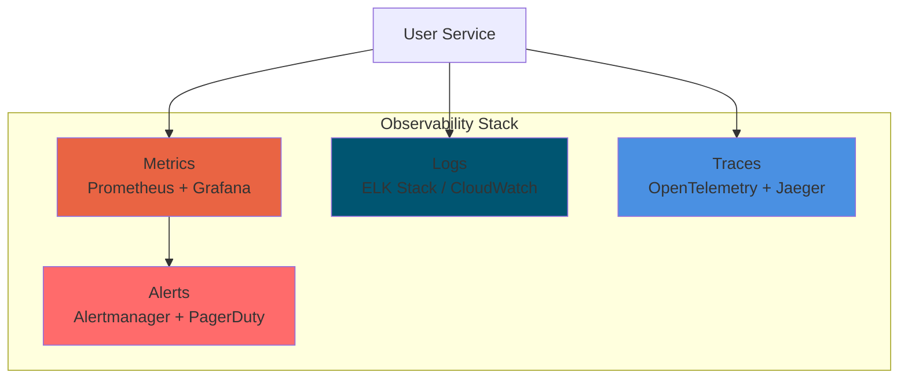
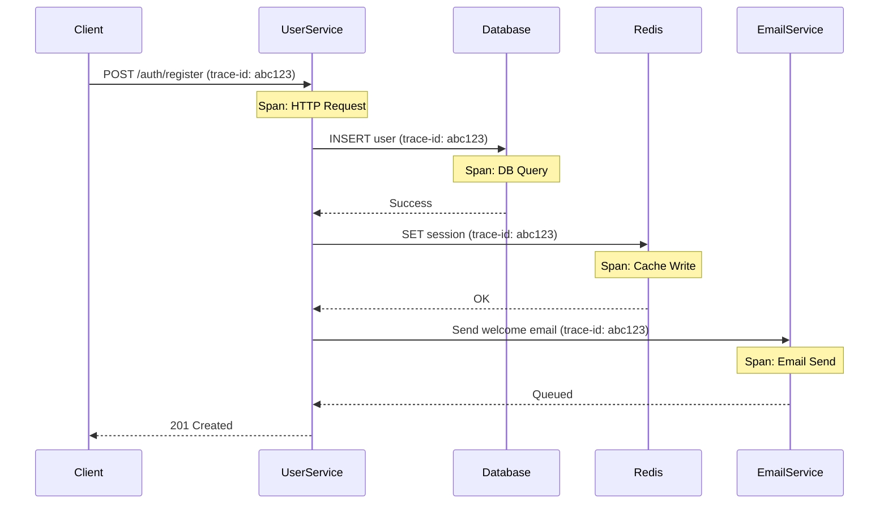

# Monitoring & Observability

## Overview

The User Service implements comprehensive observability through structured logging, metrics collection, and distributed tracing to ensure system health, performance, and rapid troubleshooting.

## Observability Pillars



## Metrics

### Prometheus Integration

The User Service exposes metrics at `/metrics` endpoint in Prometheus format.

**Metric Types:**

| Type | Usage | Example |
|------|-------|---------|
| **Counter** | Monotonically increasing values | `http_requests_total`, `user_registrations_total` |
| **Gauge** | Values that can go up or down | `active_connections`, `memory_usage_bytes` |
| **Histogram** | Distribution of values | `http_request_duration_seconds`, `db_query_duration_seconds` |
| **Summary** | Similar to histogram with quantiles | `api_response_time_seconds` |

### Application Metrics

#### HTTP Metrics

```typescript
// Instrumentation example
import { Counter, Histogram, register } from 'prom-client';

// Request counter
const httpRequestsTotal = new Counter({
  name: 'http_requests_total',
  help: 'Total number of HTTP requests',
  labelNames: ['method', 'route', 'status_code'],
});

// Request duration
const httpRequestDuration = new Histogram({
  name: 'http_request_duration_seconds',
  help: 'HTTP request duration in seconds',
  labelNames: ['method', 'route', 'status_code'],
  buckets: [0.01, 0.05, 0.1, 0.5, 1, 2, 5],
});

// Middleware
app.use((req, res, next) => {
  const start = Date.now();
  
  res.on('finish', () => {
    const duration = (Date.now() - start) / 1000;
    
    httpRequestsTotal.labels(req.method, req.route?.path || req.path, res.statusCode.toString()).inc();
    httpRequestDuration.labels(req.method, req.route?.path || req.path, res.statusCode.toString()).observe(duration);
  });
  
  next();
});
```

**Exposed Metrics:**

| Metric | Type | Description |
|--------|------|-------------|
| `http_requests_total` | Counter | Total HTTP requests by method, route, status |
| `http_request_duration_seconds` | Histogram | Request latency distribution |
| `http_requests_in_flight` | Gauge | Current requests being processed |
| `http_errors_total` | Counter | Total errors by type and endpoint |

#### Business Metrics

| Metric | Type | Description |
|--------|------|-------------|
| `user_registrations_total` | Counter | Total user registrations |
| `user_logins_total` | Counter | Successful user logins |
| `user_login_failures_total` | Counter | Failed login attempts |
| `password_reset_requests_total` | Counter | Password reset requests |
| `active_sessions` | Gauge | Currently active user sessions |
| `role_assignments_total` | Counter | Role assignments by role type |

#### System Metrics

| Metric | Type | Description |
|--------|------|-------------|
| `nodejs_heap_size_used_bytes` | Gauge | V8 heap memory usage |
| `nodejs_heap_size_total_bytes` | Gauge | Total V8 heap memory |
| `nodejs_external_memory_bytes` | Gauge | Memory used by C++ objects |
| `process_cpu_usage_percent` | Gauge | CPU usage percentage |
| `process_uptime_seconds` | Counter | Process uptime |

#### Database Metrics

| Metric | Type | Description |
|--------|------|-------------|
| `db_queries_total` | Counter | Total database queries by operation |
| `db_query_duration_seconds` | Histogram | Query execution time |
| `db_connections_active` | Gauge | Active database connections |
| `db_connections_idle` | Gauge | Idle database connections in pool |
| `db_errors_total` | Counter | Database errors by type |

#### Cache Metrics

| Metric | Type | Description |
|--------|------|-------------|
| `redis_commands_total` | Counter | Total Redis commands by operation |
| `redis_command_duration_seconds` | Histogram | Redis command execution time |
| `redis_cache_hits_total` | Counter | Cache hits |
| `redis_cache_misses_total` | Counter | Cache misses |
| `redis_connections_active` | Gauge | Active Redis connections |

### Grafana Dashboards

#### Main Service Dashboard

**Panels:**

1. **Request Rate** - HTTP requests per second
2. **Error Rate** - Errors per second by type
3. **Latency** - p50, p95, p99 response times
4. **Throughput** - Data transfer rate
5. **Active Connections** - Current connections
6. **CPU Usage** - CPU utilization over time
7. **Memory Usage** - Memory consumption
8. **Database Performance** - Query latency and throughput

**Example PromQL Queries:**

```promql
# Request rate (per second)
rate(http_requests_total[5m])

# Error rate
rate(http_errors_total[5m])

# P95 latency
histogram_quantile(0.95, rate(http_request_duration_seconds_bucket[5m]))

# Success rate
sum(rate(http_requests_total{status_code=~"2.."}[5m])) /
sum(rate(http_requests_total[5m])) * 100
```

## Logging

### Log Levels

| Level | Usage | Example |
|-------|-------|---------|
| **ERROR** | Application errors | Database connection failed, unhandled exceptions |
| **WARN** | Potentially harmful situations | Rate limit approaching, deprecated API usage |
| **INFO** | Informational messages | User login, registration events |
| **DEBUG** | Detailed diagnostic information | Request/response details, query execution |

### Structured Logging

**Log Format (JSON):**

```json
{
  "level": "info",
  "message": "User logged in successfully",
  "timestamp": "2025-01-07T10:30:00.000Z",
  "service": "user-service",
  "environment": "production",
  "version": "1.0.0",
  "requestId": "req_abc123def456",
  "userId": "550e8400-e29b-41d4-a716-446655440000",
  "context": {
    "method": "POST",
    "path": "/api/v1/auth/login",
    "statusCode": 200,
    "duration": 145,
    "ip": "192.168.1.100",
    "userAgent": "Mozilla/5.0..."
  }
}
```

### Winston Configuration

```typescript
import winston from 'winston';

const logger = winston.createLogger({
  level: process.env.LOG_LEVEL || 'info',
  format: winston.format.combine(
    winston.format.timestamp(),
    winston.format.errors({ stack: true }),
    winston.format.json()
  ),
  defaultMeta: {
    service: 'user-service',
    environment: process.env.NODE_ENV,
    version: process.env.npm_package_version,
  },
  transports: [
    // Console output
    new winston.transports.Console({
      format: process.env.NODE_ENV === 'development'
        ? winston.format.combine(
            winston.format.colorize(),
            winston.format.simple()
          )
        : winston.format.json(),
    }),
    
    // File output (errors only)
    new winston.transports.File({
      filename: 'logs/error.log',
      level: 'error',
    }),
    
    // File output (all logs)
    new winston.transports.File({
      filename: 'logs/combined.log',
    }),
  ],
});
```

### Log Aggregation

**ELK Stack (Elasticsearch, Logstash, Kibana):**


**Key Queries:**

```
# Find all errors
level: ERROR

# Find errors for specific user
level: ERROR AND userId: "550e8400-e29b-41d4-a716-446655440000"

# Find slow requests (> 1s)
context.duration: >1000

# Find failed logins
message: "login failed" OR message: "Invalid credentials"

# Find requests by ID
requestId: "req_abc123def456"
```

## Distributed Tracing

### OpenTelemetry Integration

Distributed tracing tracks requests across multiple services.



**Trace Attributes:**

- **trace-id**: Unique identifier for entire request flow
- **span-id**: Identifier for each operation within trace
- **parent-span-id**: Links spans in parent-child relationship
- **duration**: Time taken for operation
- **tags**: Additional metadata (user-id, endpoint, etc.)

## Health Checks

### Endpoint: GET /health

**Healthy Response (200):**

```json
{
  "status": "healthy",
  "timestamp": "2025-01-07T10:30:00Z",
  "version": "1.0.0",
  "uptime": 86400,
  "checks": {
    "database": {
      "status": "healthy",
      "responseTime": 5
    },
    "redis": {
      "status": "healthy",
      "responseTime": 2
    },
    "email_service": {
      "status": "healthy",
      "responseTime": 12
    },
    "audit_service": {
      "status": "healthy",
      "responseTime": 8
    }
  }
}
```

**Degraded Response (200):**

```json
{
  "status": "degraded",
  "timestamp": "2025-01-07T10:30:00Z",
  "version": "1.0.0",
  "uptime": 86400,
  "checks": {
    "database": {
      "status": "healthy",
      "responseTime": 5
    },
    "redis": {
      "status": "healthy",
      "responseTime": 2
    },
    "email_service": {
      "status": "unhealthy",
      "responseTime": 5000,
      "error": "Connection timeout"
    },
    "audit_service": {
      "status": "healthy",
      "responseTime": 8
    }
  }
}
```

**Unhealthy Response (503):**

```json
{
  "status": "unhealthy",
  "timestamp": "2025-01-07T10:30:00Z",
  "checks": {
    "database": {
      "status": "unhealthy",
      "error": "Connection refused"
    }
  }
}
```

## Alerting

### Alert Rules

#### Critical Alerts (P1 - Immediate Action)

| Alert | Condition | Action |
|-------|-----------|--------|
| Service Down | All replicas unhealthy for 2 minutes | Page on-call engineer |
| Database Connection Failed | DB connection errors > 10 in 1 minute | Page on-call + DBA |
| High Error Rate | Error rate > 5% for 5 minutes | Page on-call engineer |
| Memory Leak | Memory usage > 90% for 10 minutes | Page on-call engineer |

#### Warning Alerts (P2 - Urgent)

| Alert | Condition | Action |
|-------|-----------|--------|
| High Latency | P95 latency > 500ms for 5 minutes | Notify team channel |
| Elevated Error Rate | Error rate > 1% for 10 minutes | Notify team channel |
| CPU Usage High | CPU > 80% for 10 minutes | Notify team channel |
| Cache Miss Rate High | Cache miss rate > 50% for 10 minutes | Notify team channel |

#### Info Alerts (P3 - Monitoring)

| Alert | Condition | Action |
|-------|-----------|--------|
| API Endpoint Deprecated | Deprecated endpoint usage detected | Log and notify weekly |
| Scaling Event | HPA triggered scale up/down | Log event |
| Slow Query | Database query > 1s | Log for analysis |

### AlertManager Configuration

```yaml
# alertmanager.yml
route:
  group_by: ['alertname', 'severity']
  group_wait: 10s
  group_interval: 10s
  repeat_interval: 12h
  receiver: 'team-channel'
  routes:
  - match:
      severity: critical
    receiver: 'pagerduty'
  - match:
      severity: warning
    receiver: 'team-channel'

receivers:
- name: 'pagerduty'
  pagerduty_configs:
  - service_key: <pagerduty-key>

- name: 'team-channel'
  slack_configs:
  - api_url: <slack-webhook>
    channel: '#platform-alerts'
    title: 'User Service Alert'
```

### Prometheus Alert Rules

```yaml
# prometheus-rules.yml
groups:
- name: user-service
  rules:
  - alert: HighErrorRate
    expr: rate(http_errors_total[5m]) / rate(http_requests_total[5m]) > 0.05
    for: 5m
    labels:
      severity: critical
    annotations:
      summary: "High error rate detected"
      description: "Error rate is {{ $value }}% (threshold: 5%)"

  - alert: HighLatency
    expr: histogram_quantile(0.95, rate(http_request_duration_seconds_bucket[5m])) > 0.5
    for: 5m
    labels:
      severity: warning
    annotations:
      summary: "High API latency"
      description: "P95 latency is {{ $value }}s"

  - alert: DatabaseConnectionErrors
    expr: rate(db_errors_total{type="connection"}[1m]) > 10
    for: 1m
    labels:
      severity: critical
    annotations:
      summary: "Database connection errors"
      description: "{{ $value }} connection errors in last minute"
```

## SLI/SLO/SLA

### Service Level Indicators (SLI)

| SLI | Measurement | Target |
|-----|-------------|--------|
| **Availability** | Successful requests / Total requests | > 99.9% |
| **Latency** | P95 response time | < 200ms |
| **Throughput** | Requests per second | > 1000 req/s |
| **Error Rate** | Failed requests / Total requests | < 0.1% |

### Service Level Objectives (SLO)

| Objective | Target | Measurement Period |
|-----------|--------|-------------------|
| API Availability | 99.9% | 30 days |
| API Latency (P95) | < 200ms | 7 days |
| API Latency (P99) | < 500ms | 7 days |
| Error Rate | < 0.1% | 24 hours |

### Service Level Agreements (SLA)

**Uptime SLA:** 99.9% monthly uptime

- **Allowed downtime:** 43.8 minutes per month
- **Compensation:** Credits for missed SLA

## Troubleshooting Guides

### High Latency

1. Check Grafana dashboard for latency spikes
2. Identify slow endpoints in metrics
3. Check database query performance
4. Review Redis cache hit rate
5. Check external service response times
6. Scale up if CPU/Memory constrained

### High Error Rate

1. Check error logs in Kibana
2. Group errors by type and endpoint
3. Check recent deployments/changes
4. Verify database connectivity
5. Check external service health
6. Review recent configuration changes

### Memory Leak

1. Check heap usage metrics
2. Take heap dump: `kill -USR2 <pid>`
3. Analyze with Chrome DevTools
4. Review recent code changes
5. Check for connection leaks
6. Restart affected pods as mitigation

---

**Last Updated**: 2025-01-07  
**Document Owner**: Platform Team

