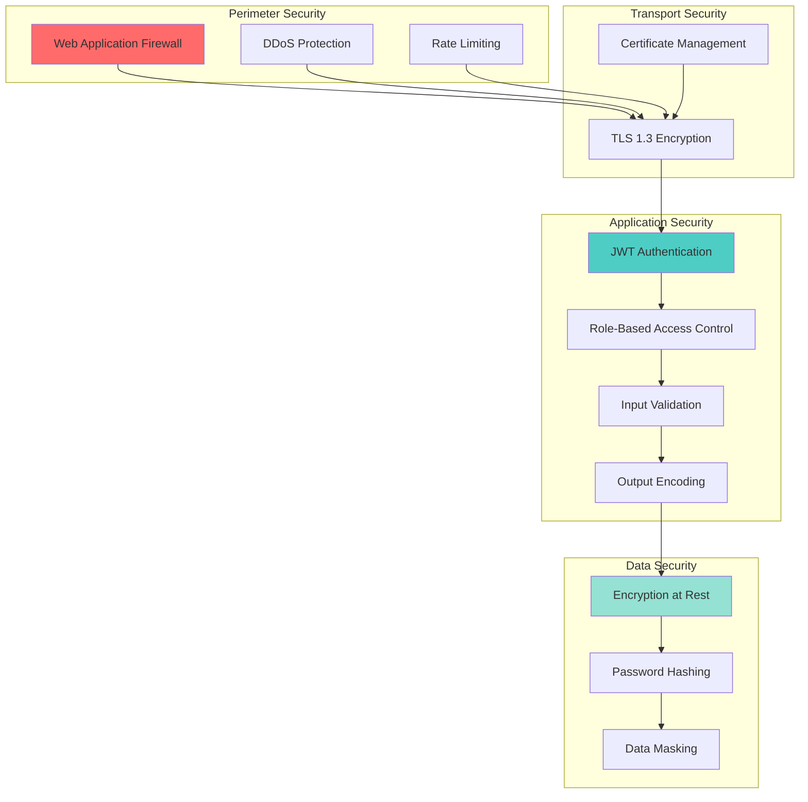
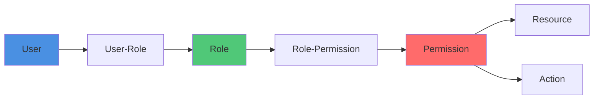

# Security

## Overview

The User Service implements defense-in-depth security with multiple layers of protection, following OWASP best practices and industry security standards.

## Security Architecture



## Authentication & Authorization

### JWT Security

**Token Configuration:**

```typescript
const jwtConfig = {
  algorithm: 'HS256',              // HMAC with SHA-256
  expiresIn: '1h',                 // Access token: 1 hour
  refreshExpiresIn: '15d',         // Refresh token: 15 days
  issuer: 'user-service',
  audience: 'kinoshita-labs',
};
```

**Security Measures:**

1. **Strong Secret Key** - Minimum 256-bit random key
2. **Short Token Lifetime** - Access tokens expire in 1 hour
3. **Token Refresh** - Refresh tokens for extended sessions
4. **Token Revocation** - Server-side session invalidation
5. **Signature Verification** - All tokens cryptographically signed

**Best Practices:**

```typescript
// ✅ DO: Store JWT secret in environment variable
const JWT_SECRET = process.env.JWT_SECRET;

// ❌ DON'T: Hardcode secrets
const JWT_SECRET = 'my-secret-key';

// ✅ DO: Validate token thoroughly
function verifyToken(token: string) {
  try {
    const payload = jwt.verify(token, JWT_SECRET, {
      algorithms: ['HS256'],
      issuer: 'user-service',
      audience: 'kinoshita-labs',
    });
    return payload;
  } catch (error) {
    throw new UnauthorizedError('Invalid token');
  }
}

// ❌ DON'T: Skip validation
function verifyToken(token: string) {
  const payload = jwt.decode(token); // No verification!
  return payload;
}
```

### Password Security

**Requirements:**

- Minimum 8 characters
- Must contain: uppercase, lowercase, number, special character
- Common password check (top 10k leaked passwords blocked)
- Password history (last 5 passwords cannot be reused)

**Hashing with bcrypt:**

```typescript
import bcrypt from 'bcrypt';

// Hash password
const SALT_ROUNDS = 12; // 2^12 = 4096 iterations
const hashedPassword = await bcrypt.hash(plainPassword, SALT_ROUNDS);

// Verify password
const isValid = await bcrypt.compare(plainPassword, hashedPassword);
```

**Why bcrypt?**
- Adaptive (cost factor can increase as hardware improves)
- Deliberately slow (prevents brute-force attacks)
- Automatic salt generation
- Battle-tested and industry-standard

**Password Storage:**

```
✅ Stored: Hashed password (bcrypt)
❌ Never stored: Plain-text password
❌ Never logged: Password in logs
❌ Never exposed: Password in API responses
```

### Role-Based Access Control (RBAC)

**Permission Model:**



**Authorization Middleware:**

```typescript
export const requirePermission = (permission: string) => {
  return async (req: Request, res: Response, next: NextFunction) => {
    // Extract user from JWT
    const user = req.user;
    
    // Load user's permissions (with caching)
    const userPermissions = await getUserPermissions(user.id);
    
    // Check if user has required permission
    if (!userPermissions.includes(permission) && !userPermissions.includes('*:*')) {
      return res.status(403).json({
        error: 'ForbiddenError',
        message: `Insufficient permissions. Required: ${permission}`,
      });
    }
    
    next();
  };
};

// Usage
app.delete('/users/:id', requireAuth, requirePermission('users:delete'), deleteUserHandler);
```

## Input Validation & Sanitization

### Validation with Zod

```typescript
import { z } from 'zod';

// User registration schema
const registerSchema = z.object({
  email: z.string()
    .email('Invalid email format')
    .max(255, 'Email too long'),
  
  password: z.string()
    .min(8, 'Password must be at least 8 characters')
    .max(128, 'Password too long')
    .regex(
      /^(?=.*[a-z])(?=.*[A-Z])(?=.*\d)(?=.*[@$!%*?&])/,
      'Password must contain uppercase, lowercase, number, and special character'
    ),
  
  firstName: z.string()
    .min(1, 'First name required')
    .max(50, 'First name too long')
    .regex(/^[a-zA-Z\s-']+$/, 'Invalid characters in first name'),
  
  lastName: z.string()
    .min(1, 'Last name required')
    .max(50, 'Last name too long')
    .regex(/^[a-zA-Z\s-']+$/, 'Invalid characters in last name'),
  
  phoneNumber: z.string()
    .regex(/^\+?[1-9]\d{1,14}$/, 'Invalid phone number format')
    .optional(),
});

// Validation middleware
export const validateRequest = (schema: z.ZodSchema) => {
  return (req: Request, res: Response, next: NextFunction) => {
    try {
      schema.parse(req.body);
      next();
    } catch (error) {
      if (error instanceof z.ZodError) {
        return res.status(400).json({
          error: 'ValidationError',
          message: 'Request validation failed',
          details: error.errors.map(e => ({
            field: e.path.join('.'),
            message: e.message,
          })),
        });
      }
      next(error);
    }
  };
};
```

### SQL Injection Prevention

**Using Prisma ORM:**

```typescript
// ✅ SAFE: Parameterized query via Prisma
const user = await prisma.user.findUnique({
  where: { email: userProvidedEmail },
});

// ❌ UNSAFE: Raw SQL with string concatenation
const user = await prisma.$queryRaw(
  `SELECT * FROM users WHERE email = '${userProvidedEmail}'`
);

// ✅ SAFE: Raw query with parameters
const user = await prisma.$queryRaw`
  SELECT * FROM users WHERE email = ${userProvidedEmail}
`;
```

**Why Prisma is safe:**
- Automatically uses prepared statements
- Type-safe queries prevent common errors
- Input sanitization built-in

### XSS Protection

**Output Encoding:**

```typescript
import DOMPurify from 'isomorphic-dompurify';

// Sanitize HTML content
function sanitizeHtml(dirty: string): string {
  return DOMPurify.sanitize(dirty, {
    ALLOWED_TAGS: ['b', 'i', 'em', 'strong', 'a'],
    ALLOWED_ATTR: ['href'],
  });
}

// Escape for HTML context
function escapeHtml(text: string): string {
  const map: Record<string, string> = {
    '&': '&amp;',
    '<': '&lt;',
    '>': '&gt;',
    '"': '&quot;',
    "'": '&#039;',
  };
  return text.replace(/[&<>"']/g, m => map[m]);
}
```

**Content Security Policy (CSP):**

```typescript
import helmet from 'helmet';

app.use(helmet.contentSecurityPolicy({
  directives: {
    defaultSrc: ["'self'"],
    scriptSrc: ["'self'"],
    styleSrc: ["'self'", "'unsafe-inline'"],
    imgSrc: ["'self'", 'data:', 'https:'],
    connectSrc: ["'self'"],
    fontSrc: ["'self'"],
    objectSrc: ["'none'"],
    mediaSrc: ["'self'"],
    frameSrc: ["'none'"],
  },
}));
```

## Transport Security

### TLS Configuration

**Minimum TLS version:** TLS 1.3 (TLS 1.2 minimum)

**Cipher Suites (ordered by preference):**
```
TLS_AES_256_GCM_SHA384
TLS_CHACHA20_POLY1305_SHA256
TLS_AES_128_GCM_SHA256
```

**Certificate Management:**

- Automatic renewal via cert-manager (Let's Encrypt)
- 90-day certificate lifetime
- Monitoring for expiration (alert at 30 days)

### HTTPS Enforcement

```typescript
// Redirect HTTP to HTTPS
app.use((req, res, next) => {
  if (req.headers['x-forwarded-proto'] !== 'https' && process.env.NODE_ENV === 'production') {
    return res.redirect(`https://${req.headers.host}${req.url}`);
  }
  next();
});

// HSTS Header
app.use(helmet.hsts({
  maxAge: 31536000, // 1 year
  includeSubDomains: true,
  preload: true,
}));
```

## Data Security

### Encryption at Rest

**Database Encryption:**
- PostgreSQL transparent data encryption (TDE)
- Encrypted backups
- Encrypted snapshots

**Secrets Management:**
- Kubernetes Secrets (encrypted in etcd)
- External secrets operator integration
- AWS Secrets Manager / HashiCorp Vault

### Data Masking

**PII Protection in Logs:**

```typescript
// Mask sensitive data before logging
function maskPII(data: any): any {
  const masked = { ...data };
  
  if (masked.email) {
    const [local, domain] = masked.email.split('@');
    masked.email = `${local.substring(0, 2)}***@${domain}`;
  }
  
  if (masked.phoneNumber) {
    masked.phoneNumber = `***${masked.phoneNumber.slice(-4)}`;
  }
  
  if (masked.password) {
    masked.password = '[REDACTED]';
  }
  
  return masked;
}

// Log user data
logger.info('User created', maskPII(userData));
```

### Data Retention

| Data Type | Retention Period | Action After |
|-----------|------------------|--------------|
| User accounts | Active + 2 years inactive | Soft delete, then purge |
| Session data | 15 days | Auto-delete |
| Audit logs | 7 years | Archive to cold storage |
| Access logs | 90 days | Delete |
| Error logs | 30 days | Delete |

## Rate Limiting & DDoS Protection

### Application Rate Limiting

```typescript
import rateLimit from 'express-rate-limit';

// Global rate limiter
const globalLimiter = rateLimit({
  windowMs: 15 * 60 * 1000, // 15 minutes
  max: 100, // 100 requests per window
  message: 'Too many requests from this IP, please try again later',
  standardHeaders: true,
  legacyHeaders: false,
});

// Auth endpoint rate limiter (stricter)
const authLimiter = rateLimit({
  windowMs: 15 * 60 * 1000,
  max: 5, // 5 login attempts per 15 minutes
  skipSuccessfulRequests: true,
  message: 'Too many login attempts, please try again later',
});

app.use('/api/', globalLimiter);
app.use('/api/v1/auth/login', authLimiter);
```

### Redis-Based Rate Limiting

```typescript
import Redis from 'ioredis';

const redis = new Redis(process.env.REDIS_URL);

async function checkRateLimit(
  identifier: string,
  maxRequests: number,
  windowSeconds: number
): Promise<boolean> {
  const key = `ratelimit:${identifier}`;
  const current = await redis.incr(key);
  
  if (current === 1) {
    await redis.expire(key, windowSeconds);
  }
  
  return current <= maxRequests;
}

// Usage
app.use(async (req, res, next) => {
  const identifier = req.user?.id || req.ip;
  const allowed = await checkRateLimit(identifier, 1000, 900); // 1000 req per 15 min
  
  if (!allowed) {
    return res.status(429).json({
      error: 'RateLimitExceeded',
      message: 'Too many requests',
    });
  }
  
  next();
});
```

## Security Headers

### Helmet.js Configuration

```typescript
import helmet from 'helmet';

app.use(helmet({
  // Content Security Policy
  contentSecurityPolicy: {
    directives: {
      defaultSrc: ["'self'"],
      scriptSrc: ["'self'"],
      styleSrc: ["'self'", "'unsafe-inline'"],
    },
  },
  
  // HTTP Strict Transport Security
  hsts: {
    maxAge: 31536000,
    includeSubDomains: true,
    preload: true,
  },
  
  // X-Frame-Options
  frameguard: {
    action: 'deny',
  },
  
  // X-Content-Type-Options
  noSniff: true,
  
  // X-XSS-Protection
  xssFilter: true,
  
  // Referrer-Policy
  referrerPolicy: {
    policy: 'strict-origin-when-cross-origin',
  },
}));
```

### CORS Configuration

```typescript
import cors from 'cors';

app.use(cors({
  origin: process.env.CORS_ORIGIN?.split(',') || 'https://app.kinoshita-labs.com',
  methods: ['GET', 'POST', 'PUT', 'PATCH', 'DELETE'],
  allowedHeaders: ['Content-Type', 'Authorization'],
  exposedHeaders: ['X-Request-ID', 'X-RateLimit-Remaining'],
  credentials: true,
  maxAge: 86400, // 24 hours
}));
```

## Audit Logging

### Security Events

All security-relevant events are logged:

| Event | Log Level | Retention |
|-------|-----------|-----------|
| User login | INFO | 90 days |
| Failed login | WARN | 90 days |
| Password change | INFO | 7 years |
| Role assignment | INFO | 7 years |
| Permission denied | WARN | 90 days |
| Account suspension | WARN | 7 years |
| Admin actions | INFO | 7 years |

### Audit Log Format

```json
{
  "level": "info",
  "event": "user.login",
  "timestamp": "2025-01-07T10:30:00.000Z",
  "actor": {
    "userId": "550e8400-e29b-41d4-a716-446655440000",
    "email": "john.doe@example.com",
    "ip": "192.168.1.100"
  },
  "action": "login",
  "resource": "user",
  "resourceId": "550e8400-e29b-41d4-a716-446655440000",
  "result": "success",
  "metadata": {
    "userAgent": "Mozilla/5.0...",
    "location": "San Francisco, US"
  }
}
```

## Vulnerability Management

### Dependency Scanning

```bash
# Check for vulnerabilities
npm audit

# Fix vulnerabilities automatically
npm audit fix

# Generate vulnerability report
npm audit --json > audit-report.json
```

**Automated Scanning:**
- Dependabot (GitHub) - Weekly automatic PRs
- Snyk integration - Real-time vulnerability alerts
- CI/CD pipeline blocks - Fail builds on high/critical vulnerabilities

### Security Testing

**OWASP ZAP Integration:**

```yaml
# .github/workflows/security-scan.yml
name: Security Scan

on:
  schedule:
    - cron: '0 2 * * 1' # Weekly on Monday at 2 AM

jobs:
  zap_scan:
    runs-on: ubuntu-latest
    steps:
      - name: ZAP Scan
        uses: zaproxy/action-baseline@v0.7.0
        with:
          target: 'https://user-service-staging.kinoshita-labs.com'
```

## Incident Response

### Security Incident Procedure

1. **Detection** - Alerts trigger from monitoring
2. **Analysis** - Assess scope and impact
3. **Containment** - Isolate affected systems
4. **Eradication** - Remove threat
5. **Recovery** - Restore services
6. **Lessons Learned** - Post-incident review

### Security Contacts

- **Security Team**: security@kinoshita-labs.com
- **On-Call**: PagerDuty rotation
- **Vulnerability Reports**: security-reports@kinoshita-labs.com

## Compliance

### OWASP Top 10 Coverage

| Vulnerability | Mitigation |
|---------------|------------|
| A01: Broken Access Control | RBAC, permission checks |
| A02: Cryptographic Failures | TLS 1.3, bcrypt, encrypted storage |
| A03: Injection | Prisma ORM, input validation |
| A04: Insecure Design | Security by design, threat modeling |
| A05: Security Misconfiguration | Helmet.js, secure defaults |
| A06: Vulnerable Components | Dependency scanning, updates |
| A07: Authentication Failures | JWT, MFA support, rate limiting |
| A08: Software and Data Integrity | Signed containers, SCA |
| A09: Logging Failures | Comprehensive audit logging |
| A10: SSRF | Input validation, network policies |

---

**Last Updated**: 2025-01-07  
**Document Owner**: Platform Team

