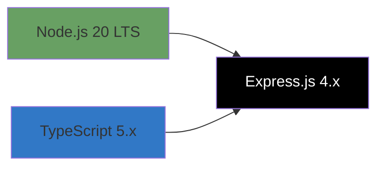
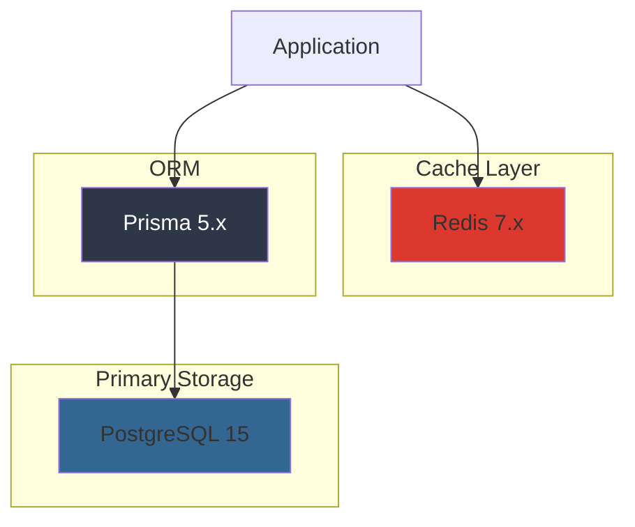
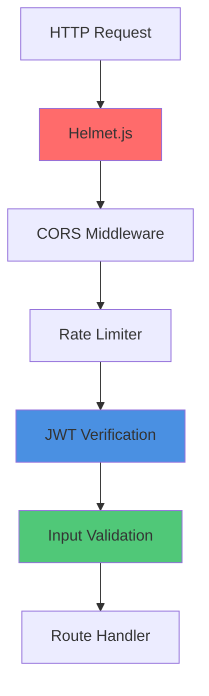
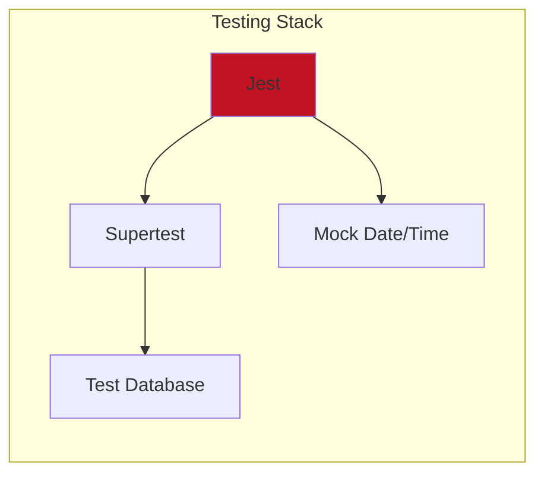
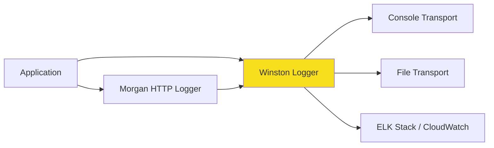

# Technology Stack

## Overview

The User Service is built on a modern, cloud-native technology stack optimized for scalability, maintainability, and developer productivity.

## Core Technologies

### Runtime & Framework



| Technology | Version | Purpose | Rationale |
|------------|---------|---------|-----------|
| **Node.js** | 20 LTS | JavaScript runtime | Long-term support, excellent performance, vast ecosystem |
| **Express.js** | 4.x | Web framework | Lightweight, flexible, extensive middleware ecosystem |
| **TypeScript** | 5.x | Programming language | Type safety, better IDE support, reduced runtime errors |

**Why Express.js?**
- Battle-tested and production-ready
- Minimal overhead and high performance
- Extensive middleware ecosystem
- Easy to learn and maintain
- Great community support

### Database & Caching



| Technology | Version | Purpose | Rationale |
|------------|---------|---------|-----------|
| **PostgreSQL** | 15 | Relational database | ACID compliance, rich feature set, excellent performance |
| **Redis** | 7.x | In-memory cache | Session storage, rate limiting, high-speed caching |
| **Prisma** | 5.x | ORM | Type-safe database access, automatic migrations, excellent DX |

**Why PostgreSQL?**
- ACID transactions ensure data consistency
- Rich data types (UUID, JSONB, arrays)
- Excellent performance for relational data
- Mature replication and backup solutions
- Strong community and enterprise support

**Why Redis?**
- Sub-millisecond latency
- Perfect for session management
- Built-in data structures for rate limiting
- Pub/sub capabilities for future features
- Cluster mode for high availability

**Why Prisma?**
- Type-safe database queries
- Automatic TypeScript type generation
- Migration system integrated
- Query optimization and connection pooling
- Excellent developer experience

## Authentication & Security

| Technology | Version | Purpose | Rationale |
|------------|---------|---------|-----------|
| **jsonwebtoken** | 9.x | JWT generation/verification | Standard JWT implementation, widely adopted |
| **bcrypt** | 5.x | Password hashing | Industry-standard, adaptive hashing algorithm |
| **helmet** | 7.x | Security headers | Sets secure HTTP headers automatically |
| **cors** | 2.x | Cross-origin requests | Configurable CORS policy |
| **express-rate-limit** | 7.x | Rate limiting | DDoS protection, API abuse prevention |

**Security Stack Architecture:**



## Validation & Data Processing

| Technology | Version | Purpose | Rationale |
|------------|---------|---------|-----------|
| **Zod** | 3.x | Schema validation | Type-safe validation, excellent TypeScript integration |
| **express-validator** | 7.x | Request validation | Express-specific validation middleware |

**Example Zod Schema:**

```typescript
import { z } from 'zod';

export const registerSchema = z.object({
  email: z.string().email(),
  password: z.string().min(8).regex(
    /^(?=.*[a-z])(?=.*[A-Z])(?=.*\d)(?=.*[@$!%*?&])/,
    'Password must contain uppercase, lowercase, number, and special character'
  ),
  firstName: z.string().min(1).max(50),
  lastName: z.string().min(1).max(50),
  phoneNumber: z.string().regex(/^\+?[1-9]\d{1,14}$/).optional(),
});
```

## API Documentation

| Technology | Version | Purpose | Rationale |
|------------|---------|---------|-----------|
| **Swagger/OpenAPI** | 3.0 | API specification | Industry-standard API documentation |
| **swagger-ui-express** | 5.x | Interactive docs | Browser-based API testing interface |

## Testing



| Technology | Version | Purpose | Rationale |
|------------|---------|---------|-----------|
| **Jest** | 29.x | Test framework | Fast, comprehensive, great mocking capabilities |
| **Supertest** | 6.x | API testing | HTTP assertion library for Express |
| **ts-jest** | 29.x | TypeScript support | Run TypeScript tests without compilation |

**Testing Layers:**

1. **Unit Tests** - Individual functions and services
2. **Integration Tests** - Database interactions, external APIs
3. **E2E Tests** - Complete request/response flows

## Logging & Monitoring

| Technology | Version | Purpose | Rationale |
|------------|---------|---------|-----------|
| **Winston** | 3.x | Structured logging | Flexible, multiple transports, production-ready |
| **Morgan** | 1.x | HTTP request logging | Express integration, customizable format |
| **Prometheus Client** | 15.x | Metrics collection | Industry-standard metrics format |

**Logging Architecture:**



## Development Tools

| Technology | Version | Purpose | Rationale |
|------------|---------|---------|-----------|
| **ESLint** | 8.x | Linting | Code quality enforcement |
| **Prettier** | 3.x | Code formatting | Consistent code style |
| **tsx** | 4.x | TypeScript execution | Fast TS execution for development |
| **nodemon** | 3.x | Auto-reload | Automatic server restart on changes |
| **Husky** | 9.x | Git hooks | Pre-commit validation |

## Build & Deployment


| Technology | Version | Purpose | Rationale |
|------------|---------|---------|-----------|
| **Docker** | 24.x | Containerization | Consistent environments, easy deployment |
| **Kubernetes** | 1.28+ | Orchestration | Auto-scaling, self-healing, rolling updates |
| **Helm** | 3.x | Package management | Templated K8s deployments |

## External Services

| Service | Purpose | Integration |
|---------|---------|-------------|
| **Email Service** | Transactional emails | REST API |
| **Audit Service** | Event logging | REST API + Message Queue |
| **Observability Platform** | Monitoring | Prometheus + Grafana |

## Technology Decision Rationale

### Node.js + TypeScript

**Pros:**
- Excellent performance for I/O-bound operations
- Large ecosystem (npm)
- Type safety with TypeScript reduces bugs
- Same language for frontend and backend
- Great tooling and IDE support

**Cons:**
- Single-threaded (mitigated with clustering)
- Less suitable for CPU-intensive tasks

### PostgreSQL

**Pros:**
- ACID transactions
- Rich feature set (JSONB, full-text search, etc.)
- Excellent performance and scalability
- Strong consistency guarantees
- Mature ecosystem

**Cons:**
- More complex than NoSQL for simple use cases
- Scaling writes requires more planning

**Why not MongoDB?**
- User data is highly relational (users ↔ roles ↔ permissions)
- ACID transactions are critical for financial/identity data
- PostgreSQL's JSONB provides NoSQL flexibility when needed

### Express.js

**Pros:**
- Lightweight and unopinionated
- Extensive middleware ecosystem
- Easy to learn and maintain
- Great performance
- Flexible architecture

**Cons:**
- Requires more setup than full-featured frameworks

**Why not NestJS or Fastify?**
- **NestJS**: More opinionated, heavier, unnecessary for this use case
- **Fastify**: Slightly faster, but Express's ecosystem is more mature

### JWT Authentication

**Pros:**
- Stateless (scales horizontally easily)
- Standard format (RFC 7519)
- Self-contained (includes user info)
- Wide library support

**Cons:**
- Cannot invalidate tokens server-side (mitigated with refresh tokens)
- Larger than session IDs

**Why not session-based?**
- Session-based requires sticky sessions or shared session store
- JWT enables stateless microservices architecture
- Better for API-first design

## Dependency Management

### Production Dependencies

```json
{
  "dependencies": {
    "express": "^4.18.2",
    "prisma": "^5.7.0",
    "@prisma/client": "^5.7.0",
    "jsonwebtoken": "^9.0.2",
    "bcrypt": "^5.1.1",
    "redis": "^4.6.11",
    "zod": "^3.22.4",
    "helmet": "^7.1.0",
    "cors": "^2.8.5",
    "winston": "^3.11.0",
    "prom-client": "^15.0.0"
  }
}
```

### Development Dependencies

```json
{
  "devDependencies": {
    "@types/node": "^20.10.6",
    "@types/express": "^4.17.21",
    "typescript": "^5.3.3",
    "tsx": "^4.7.0",
    "jest": "^29.7.0",
    "ts-jest": "^29.1.1",
    "supertest": "^6.3.3",
    "eslint": "^8.56.0",
    "prettier": "^3.1.1",
    "nodemon": "^3.0.2"
  }
}
```

## Performance Benchmarks

| Metric | Value | Test Conditions |
|--------|-------|-----------------|
| **Requests/sec** | 1,250 | 100 concurrent users |
| **Latency (p50)** | 45ms | Database read operations |
| **Latency (p95)** | 145ms | Complex queries with JOINs |
| **Latency (p99)** | 380ms | Write operations with validations |
| **Memory Usage** | 120MB | Baseline per instance |
| **CPU Usage** | 15% | Average load |

**Benchmark Environment:**
- Instance: 2 vCPU, 4GB RAM
- Database: PostgreSQL 15 (shared, 4 vCPU, 16GB RAM)
- Redis: Single node (2 vCPU, 4GB RAM)
- Network: Internal (< 1ms latency)

## Technology Alternatives Considered

| Category | Chosen | Alternative | Why Not Alternative? |
|----------|--------|-------------|----------------------|
| **Language** | TypeScript | Go | Larger ecosystem, faster development |
| | | Python | Better performance for I/O operations |
| | | Java | Lighter weight, faster startup time |
| **Database** | PostgreSQL | MongoDB | Need ACID transactions, relational data |
| | | MySQL | PostgreSQL has better JSON support |
| **Framework** | Express | NestJS | Unnecessary overhead for this use case |
| | | Fastify | Express's ecosystem more mature |
| **ORM** | Prisma | TypeORM | Better DX, type safety, performance |
| | | Sequelize | Modern API, automatic migrations |
| **Cache** | Redis | Memcached | Need data structures, pub/sub |
| **Testing** | Jest | Mocha | Better DX, built-in mocking |

## Upgrade Path

### Node.js LTS Strategy

- Currently on Node.js 20 LTS (until April 2026)
- Plan upgrade to Node.js 22 LTS in Q4 2025
- Test compatibility in staging 3 months before upgrade

### Database Migrations

- Use Prisma migrations for schema changes
- Always test migrations in staging first
- Keep migrations backward-compatible when possible
- Plan for zero-downtime migrations on critical tables

### Dependency Updates

- **Security updates**: Immediate (within 24 hours)
- **Minor updates**: Monthly maintenance window
- **Major updates**: Quarterly, with thorough testing

---

**Last Updated**: 2025-01-07  
**Document Owner**: Platform Team

